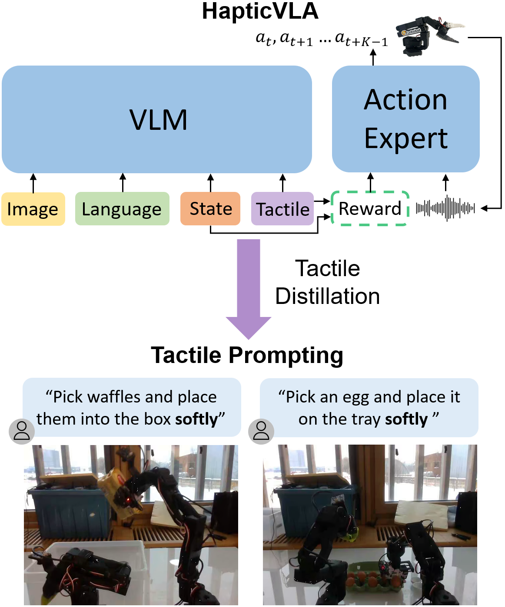
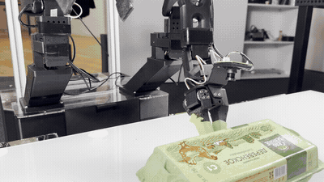
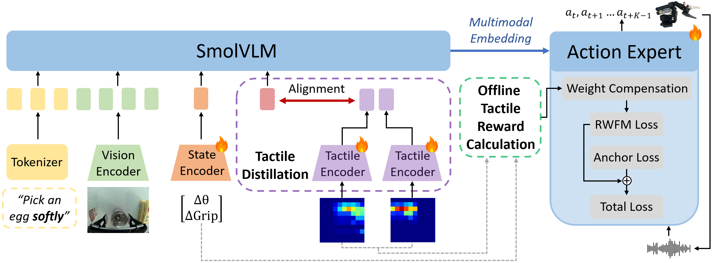
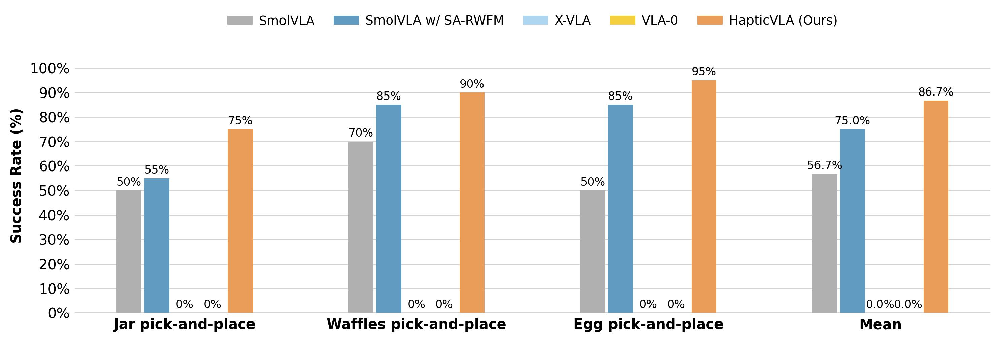

# Crab — HapticVLA

**Contact-rich manipulation via Vision-Language-Action models without
inference-time tactile sensing.**

<p align="center">
  
</p>

This is the code release for the preprint
[*HapticVLA: Contact-Rich Manipulation via Vision-Language-Action Model
without Inference-Time Tactile Sensing*](https://arxiv.org/abs/2603.15257)
(under review). The repository is a fork of
[LeRobot](https://github.com/huggingface/lerobot) that adds the **Crab**
bimanual robot platform (two SO-101 arms with a tactile-instrumented
gripper) and the training pipeline behind HapticVLA.

<p align="center">
  
  <br>
  <sub>HapticVLA grasping a fragile object on the Crab platform.</sub>
</p>

HapticVLA is a two-stage fine-tune of SmolVLA-450M:

1. **SA-RWFM** (Safety-Aware Reward-Weighted Flow Matching). The action
   expert is trained with a per-sample reward-weighted flow-matching loss
   using precomputed tactile safety rewards (over-force, peak pressure,
   concentration, asymmetry, slip) plus episode-level success/damage/risk
   terms, regularized by an L2 anchor against the initial IL checkpoint.
2. **Tactile Distillation**. A tactile-free student SmolVLA is initialized
   from the SA-RWFM teacher (tactile encoder dropped, state projection
   sliced back to proprioceptive dims) and trained on targets that blend
   ground-truth demonstrations with precomputed teacher predictions. At
   deployment the student needs only vision + proprioception — **no tactile
   hardware**.

On three contact-rich tasks (egg, waffles, marmalade jar) HapticVLA reaches
**86.7 %** mean success over 20 trials per task, outperforming the SmolVLA,
X-VLA, and VLA-0 baselines — including variants that receive live tactile
input at inference.

<p align="center">
  
  <br>
  <sub>Framework overview: offline tactile reward computation, SA-RWFM teacher
  training, and tactile distillation into a vision-only student.</sub>
</p>

<p align="center">
  
  <br>
  <sub>Success rates across the three tasks vs. SmolVLA, X-VLA, and VLA-0
  baselines.</sub>
</p>

## Repository layout

| Path | Purpose |
|------|---------|
| `src/lerobot/robots/crab/` | Crab robot implementation — bimanual host/client, tactile sensor driver, config. |
| `examples/crab/` | Teleoperation, recording, replay, and inference (sync / async / RTC / X-VLA). |
| `training/` | SA-RWFM teacher, tactile distillation, IL baselines, X-VLA baseline. See `training/README.md`. |
| `docs/paper/` | Paper-facing docs: hardware, reproduction steps, HF weight pointers. |

Everything outside `src/lerobot/robots/crab/`, `examples/crab/`, `training/`,
and `docs/paper/` is unmodified LeRobot (LeRobot follows Apache-2.0, so the
fork stays in sync with upstream for shared components such as SmolVLA).

## Hardware

- Two SO-101 manipulators. The left arm is stock; the right arm has a
  12 V servo variant and a parallel gripper with a 2×100-taxel tactile
  array (120 Hz, 1–9 N per taxel).
- Three RGB streams: Intel RealSense D435 overhead + two IMX335 5 MP wrist
  cameras, all at 640×480.
- Compute: NVIDIA Jetson Orin NX 16 GB (inference).
- Training: a single RTX 4090 (24 GB) for SA-RWFM, a single H100 for
  tactile distillation.

Full hardware breakdown in [`docs/paper/HARDWARE.md`](docs/paper/HARDWARE.md).

## Pretrained weights

Released on the Hugging Face Hub under
[`armteam/`](https://huggingface.co/armteam):

| Model | Purpose | Paper name |
|-------|---------|------------|
| [`armteam/crab-smolvla-left-arm`](https://huggingface.co/armteam/crab-smolvla-left-arm)       | Left-arm IL baseline, no tactile | left-arm multitask 12V v4 |
| [`armteam/crab-smolvla-right-arm`](https://huggingface.co/armteam/crab-smolvla-right-arm)     | Right-arm IL baseline, no tactile | right-arm multitask 12V v4 |
| [`armteam/crab-smolvla-rwfm`](https://huggingface.co/armteam/crab-smolvla-rwfm)               | SA-RWFM teacher with tactile encoder | right-arm RWFM v3 |
| [`armteam/crab-smolvla-hapticsvla`](https://huggingface.co/armteam/crab-smolvla-hapticsvla)   | Tactile-distilled student (HapticVLA) | distill RWFM v3 |

See [`docs/paper/WEIGHTS.md`](docs/paper/WEIGHTS.md) for download and
deployment snippets.

## Reproducing the paper

End-to-end walkthrough (data preparation → SA-RWFM teacher → distillation →
inference → evaluation) in
[`docs/paper/REPRODUCING.md`](docs/paper/REPRODUCING.md).

Quick start on already-released weights:

```bash
# On the Jetson Orin, using the one-command launcher:
./examples/crab/launch_crab.sh distill         # HapticVLA (student)
./examples/crab/launch_crab.sh rwfm_v3         # SA-RWFM teacher (needs tactile)
./examples/crab/launch_crab.sh v4              # plain SmolVLA IL baseline
./examples/crab/launch_crab.sh --list          # list all wired-in models
```

## Installation

Follow the upstream LeRobot install (Python 3.10+, the distribution-specific
`requirements-*.txt`, and the `lerobot` extras relevant to your hardware).
Additional training dependencies are `pyarrow`, `pyyaml`, `av`, and
`torchvision`.

```bash
pip install -e .
```

## Citation

Preprint — the paper is under review and not yet published. If you use
this code or the released checkpoints, please cite the arXiv version:

```bibtex
@misc{hapticvla2026,
  title         = {HapticVLA: Contact-Rich Manipulation via Vision-Language-Action
                   Model without Inference-Time Tactile Sensing},
  author        = {Gubernatorov, Konstantin and Sannikov, Mikhail and
                   Mikhalchuk, Ilya and Fernando, Marcelino and Kuznetsov, Egor
                   and Ogunwoye, Faith Ouwatobi and Asanov, Artem and
                   Artemov, Makar and Guo, Ziang and Tsetserukou, Dzmitry},
  year          = {2026},
  eprint        = {2603.15257},
  archivePrefix = {arXiv},
  primaryClass  = {cs.RO},
  url           = {https://arxiv.org/abs/2603.15257}
}
```

## Acknowledgments

- [LeRobot](https://github.com/huggingface/lerobot) — VLA training and
  robot-control framework.
- [SmolVLA](https://huggingface.co/lerobot/smolvla_450m) — base visuomotor
  policy.

## License

Apache 2.0 (inherited from LeRobot).
